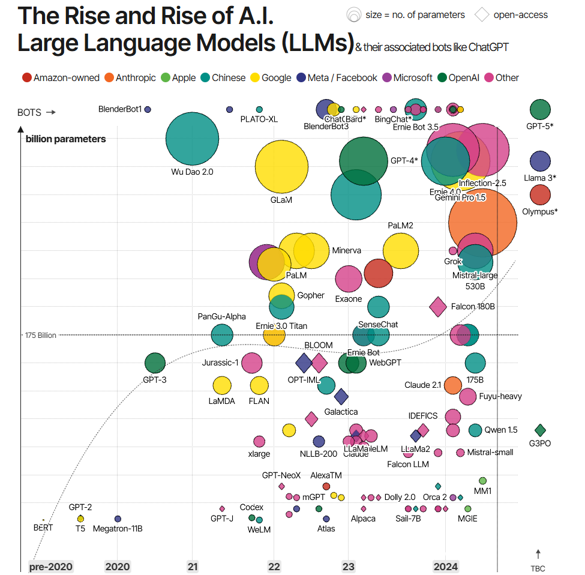
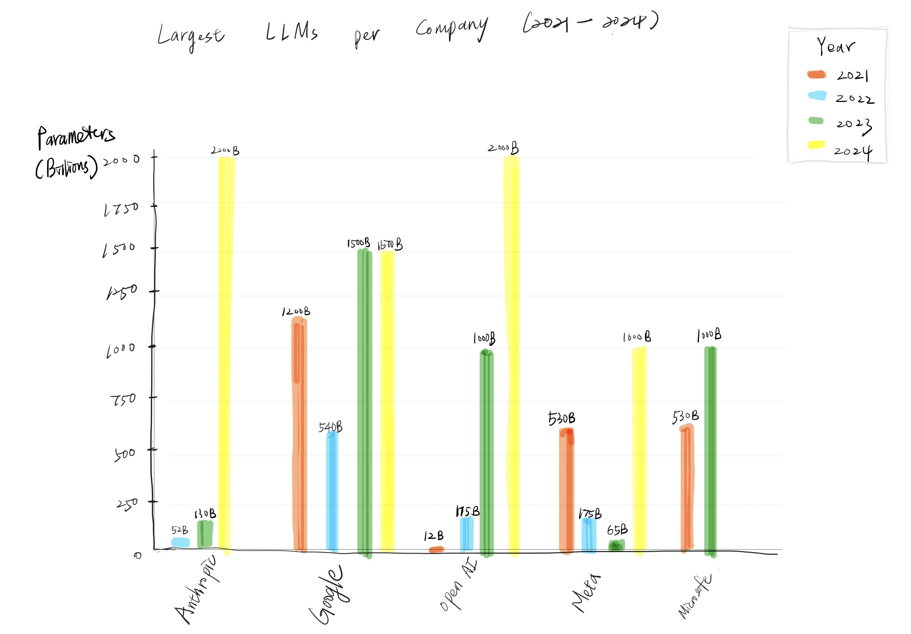

| [home page](https://cmustudent.github.io/tswd-portfolio-templates/) | [data viz examples](dataviz-examples) | [critique by design](critique-by-design) | [final project I](final-project-part-one) | [final project II](final-project-part-two) | [final project III](final-project-part-three) |

# Redesigning "The Rise of LLMs": A Critique by Design
##Overview
This project follows the critique by design methodology to analyze and redesign a data visualization from MakeoverMonday. Through systematic critique, user testing, and iterative design, I aimed to create a more effective visualization that better serves its intended audience and purpose.

## Step one: the visualization
I chose “The Rise and Rise of LLMs” from Makeover Monday because it captures a pivotal moment in the development of large language models, highlighting both the proliferation of models and the dramatic increase in their parameter sizes. 

   
   *Source: (https://data.world/makeovermonday/the-rise-and-rise-of-llms)*
   
## Step two: the critique
My first impression is that the chart is visually overwhelming: too many colors and overlapping bubbles make it hard to distinguish individual models. The lack of visual hierarchy and clear instructions limits quick understanding.
What does work is the timeline pattern—it clearly shows the surge in model development and parameter growth between 2022 and 2024. Using color to separate companies is a good idea in theory, but in practice, it creates clutter rather than clarity.
The target audience seems to be experts in AI and LLMs, such as researchers, industry professionals, or investors. For them, the chart communicates scale and density of activity, but at the cost of readability. A redesign would benefit from a simpler hierarchy, clearer labeling, and less visual noise.

## Step three: Sketch a solution

In my sketches, I wanted to simplify the original dataset, which felt overwhelming with too many overlapping bubbles. My redesign focuses on clarity and hierarchy by highlighting only the key companies and their most important models instead of showing everything at once.
I emphasized the largest models to clearly demonstrate growth in scale, and I used color to represent years, making the timeline easier to follow. This way, viewers can quickly see how the model expanded year by year and which companies drove that growth.
To reduce overlap and visual noise, I streamlined the layout so the chart focuses on two main ideas: **growth in training parameters and ownership of the models**. I tried to make it immediately clear to the audience how big these models have become and who is leading development.

## Step four: Test the solution
**Interview Results Analysis & Feedback Summary**

| **Question** | **Interview 1: In-class Group Discussion** | **Interview 2: Project Manager** |
|:-------------|:-------------------------------------------|:-------------------------------------------------------|
| **What is the first thing you notice in the chart?** | "Why isn't time shown on the axis?" | "It's about the growth of LLM models, but the title should tell more of the story." |
| **In your words, what do you think this chart is trying to tell?** | "It shows growth across the years, but unclear what 'parameters' means." | "It's showing LLM growth by parameters, but labeling should say training parameters to be clearer." |
| **Is there anything surprising or confusing?** | "Not sure what parameters stand for—maybe model scale size? Also unclear audience—experts vs. general users." | "Confusing that the x-axis doesn't directly show years. The title is too vague." |
| **Which part of the chart was most helpful?** | "You can still see the growth trend across years, and company ownership is interesting." | "The use of color to represent years makes growth easy to see." |
| **Is there anything you would change or do differently?** | "Add clearer title, define parameters, and consider audience-specific designs." | "Label the axis more specifically, include some model names, and make the largest models clearer." |

**Synthesis & Key Patterns from Feedback**

- **Consistent trend recognition** - Participants could identify the growth pattern despite other issues
- **Terminology barriers** - Universal confusion around technical terms like "parameters" hindered understanding
- **Labeling clarity essential** - Both interviews emphasized the need for clearer axis labels and more descriptive titles
- **Time representation problems** - Need to make temporal elements more explicit and accessible
- **Audience-specific design considerations** - Different user groups require different approaches:
- **Hierarchy and context improvements needed** - The critique revealed that enhancing clarity, providing better context, and establishing clear visual hierarchy are essential priorities for the final redesign

## Step five: Build the solution

<noscript></noscript><object class='tableauViz'  style='display:none;'><param name='host_url' value='https%3A%2F%2Fpublic.tableau.com%2F' /> <param name='embed_code_version' value='3' /> <param name='site_root' value='' /><param name='name' value='LLM_17582104630940&#47;LLMEvolution' /><param name='tabs' value='no' /><param name='toolbar' value='yes' /><param name='static_image' value='https:&#47;&#47;public.tableau.com&#47;static&#47;images&#47;LL&#47;LLM_17582104630940&#47;LLMEvolution&#47;1.png' /> <param name='animate_transition' value='yes' /><param name='display_static_image' value='yes' /><param name='display_spinner' value='yes' /><param name='display_overlay' value='yes' /><param name='display_count' value='yes' /><param name='language' value='en-US' /></object>
                

---
 
## What I Changed
Based on this feedback, I redesigned the chart in Tableau with the following changes:
- **Filtered to the largest models per year (2021–2024):** This reduced clutter while still telling the growth story.
- **Explicit year display:** I placed years directly on the axis, making the timeline clearer.
- **Added model names and companies:** This preserved detail for professional audiences.
- **Heat map encoding for parameters:** I used a color scale where darker shades represent larger parameter counts. This makes it easy to spot the biggest models at a glance.
- **Improved labeling and caption:** I updated the axis to "Trained on X Billion Parameters" and included a note explaining that parameters represent model size and capability.

## What My Redesigned Visualization Shows
My final chart, "LLM Evolution by Year: Comparing Largest Model", highlights the largest LLMs released from 2021–2024. By combining company ownership, model names, and a heat map of training parameters, the chart makes it easier to see:
- **Which companies released the largest models** (e.g., OpenAI, Anthropic, Google).
- **How model scale grew dramatically year over year,** especially between 2022 and 2023.
- **The competitive landscape across major AI players,** without overwhelming overlap.

## Final Thoughts
This assignment really showed me how much a chart's effectiveness depends on clarity and purpose. The original bubble chart was colorful but overwhelming—it had too much going on without guiding the audience. Redesigning it pushed me to ask: **who is this for, and what do they need to see?**
By narrowing the focus to the largest models each year, adding a caption to explain parameters, and making the timeline clearer, I was able to tell the story without the clutter. The result feels more readable, and it highlights both the rapid growth of model size and the companies driving it.
My biggest takeaway is that **good visualization isn't about cramming in all the data, it's about focusing the story**. I think my redesign does that much better than the original, showing the industry's expansion while keeping attention on scale and ownership.

## References
1. **Boolean in Tableau**  
   [https://community.tableau.com/s/question/0D54T00000qhG2GSAU/if-function-with-boolean-field](https://community.tableau.com/s/question/0D54T00000qhG2GSAU/if-function-with-boolean-field)

2. **What Are LLM Parameters?**  
   [https://www.ibm.com/think/topics/llm-parameters](https://www.ibm.com/think/topics/llm-parameters)

## AI acknowledgements
I used ChatGPT to help me troubleshoot Tableau filtering and display issues, critique and refine my visualization ideas, and reflect on different perspectives, which made the process clearer and more effective.

