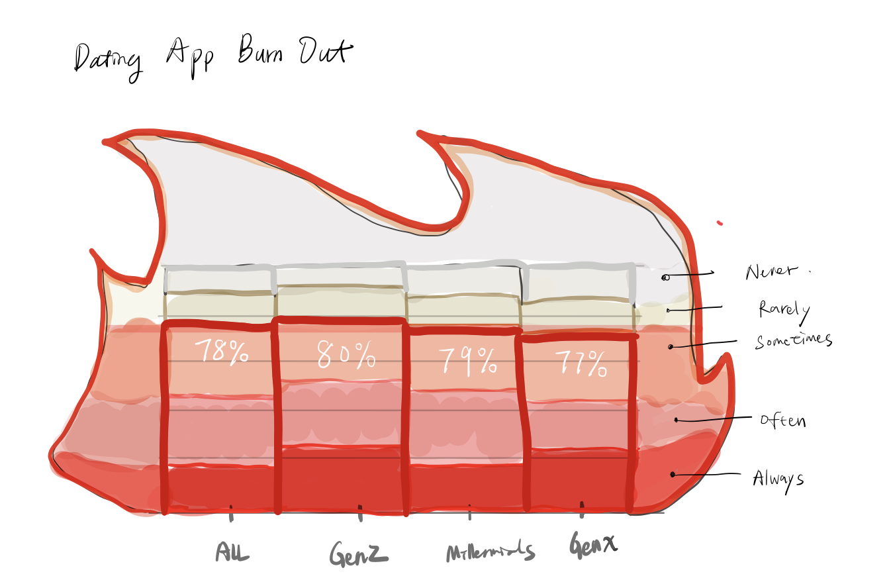

| [home page](https://cmustudent.github.io/tswd-portfolio-templates/) | [data viz examples](dataviz-examples) | [critique by design](critique-by-design) | [final project I](final-project-part-one) | [final project II](final-project-part-two) | [final project III](final-project-part-three) |

## Title
**Swiping through burnout: Data stories of love and fatigue in the digital age**

## Summary
Online dating apps have become central to how people connect in modern life, especially among millennials and Gen Z. With millions of users worldwide and billions in revenue, these platforms offer accessibility and convenience but also bring unintended consequences. Recent studies reveal that around 79% of Gen Z and 78% of millennials report burnout or fatigue from dating app use. Many describe feelings of frustration, disappointment, and emotional exhaustion caused by repetitive swiping, superficial interactions, and the endless cycle of ghosting.

This project explores the causes and impact of dating app burnout, drawing on recent statistics, surveys, and expert insights. Key factors include algorithm-driven design that encourages overuse, decision fatigue from too many choices, and the lack of depth in online interactions. At the same time, emerging trends show younger users searching for authenticity and more meaningful offline connections. Through data visualization, this project aims to highlight the scale of the issue, illustrate why dating app burnout is widespread, and suggest strategies to help users navigate fatigue while fostering healthier, more genuine relationships.

## 1. The rise of online dating apps
By 2024, dating apps had become a truly global phenomenon, with more than 360 million users worldwide engaging daily[^1].

The majority of users (60%) are between the ages 18–34, underscoring how central digital dating has become for younger generations[^1].

## 2. The Environment: Swiping Culture
Dating apps have transformed how people connect. Nearly half of users are looking for a long-term partner, while about four in ten prefer casual dating. Smaller groups use them primarily for hookups (24%) or simply to make new friends (22%)[^2].

This “swiping culture” creates an environment built on speed and instant choices — and men and women approach the apps differently, with varied motivations. Beyond intentions, time investment plays a major role: users spend close to an hour per day on dating apps, with women and millennials devoting the most time[^2]. Over time, this routine leads to fatigue from constant engagement.

## 3. The Problem: Burnout & Fatigue
Despite widespread adoption, many users remain dissatisfied. Burnout on dating apps is common, though its intensity varies across generations. A 2024 Forbes Health survey found that 79% of Gen Z and 80% of millennials reported feeling emotionally or mentally exhausted from their dating app use[^3].

## 4. Causes of Burnout
Burnout does not emerge overnight. It develops from a mix of behavioral, psychological, and structural factors. Users describe ghosting, endless swiping, superficial interactions, and lack of meaningful matches as recurring frustrations[^3]. These issues disproportionately affect younger, high-engagement users, making them especially vulnerable to emotional fatigue.

## 5. From User Impact to Meaningful Relationships
This emotional strain translates directly into user experience. Satisfaction is deeply split: 53% of users describe their dating app experience as positive, while 46% report it as negative[^2]. Gender differences sharpen this divide, with women more likely than men to describe their experiences as frustrating or unsafe.

## 6. Toward Meaningful Connections
Dating app burnout is real, but it doesn’t have to define the experience. Navigating fatigue begins with self-awareness — setting limits on time spent swiping, clarifying intentions early, and approaching apps with a healthier mindset. Used thoughtfully, dating apps can still act as gateways to authentic relationships.

These platforms remain powerful tools, but burnout underscores the need for change. Users want authenticity, safety, and long-term connections. Data shows that 1 in 10 partnered adults met their current significant other through a dating app or site[^4], reminding us that meaningful outcomes are possible. The challenge is balancing digital convenience with genuine connection — rethinking both user habits and app design to foster healthier, more meaningful relationships[^5].

# The data
This project draws on multiple publicly accessible datasets and survey findings from reputable sources to build a data-driven narrative around dating app use, burnout, and relationships. 

Datasets

| Name | URL | Description |
|------|-----|-------------|
| Forbes – Dating Statistics and Facts (2025) | [Link](https://www.forbes.com/health/dating/dating-statistics/) | Global and U.S. statistics on dating app usage, demographics, popular platforms, and success rates. Used for visualizations showing the rise of online dating apps and U.S. demographic breakdowns (Part 1). |
| Forbes Health Survey (2025) | [Link](https://www.forbes.com/health/dating/dating-app-fatigue/) | Survey showing 78% of users report burnout, with generational differences, causes of fatigue, and time spent on apps. Used for analysis of user environment and motivations (Part 2) and burnout causes (Part 4). |
| Pew Research Center – Online Dating in the U.S. (2023) | [Link](https://www.pewresearch.org/internet/2023/02/02/from-looking-for-love-to-swiping-the-field-online-dating-in-the-u-s/) | Survey findings on who uses dating apps, motivations, satisfaction levels, and demographic breakdowns by age and gender. Used for age and gender breakdown charts, motivations for using apps, and user satisfaction. |
| Pew Research Center – Key Findings (2023) | [Link](https://www.pewresearch.org/short-reads/2023/02/02/key-findings-about-online-dating-in-the-u-s/) | Insight that 1 in 10 partnered adults met their current significant other through dating apps or sites. Used for closing visualization in Part 6, emphasizing the potential for meaningful outcomes. |         

The datasets were first collected and cross-referenced to ensure consistency across years and sources. Data was cleaned and summarized for clarity, then translated into charts, pictograms, and flow diagrams that tell a cohesive story.

# Method and medium
For the final project, I will follow the storytelling flow developed in Part I as the main framework: moving from the rise of online dating apps, to user motivations and behaviors, to burnout causes and impacts, and finally toward meaningful relationships. This structured narrative will guide the creation of visuals and ensure that data supports each stage of the story arc.
For the next phase, I plan to:
	•	Use Tableau for advanced data visualization and interactive dashboards.
	•	Incorporate visual storytelling into Shorthand, allowing for a more narrative-driven, immersive presentation.
	•	Integrate both static and interactive graphics to support the final project deliverables.
The overall design will follow a storyline that builds toward a call to action: encouraging users to navigate dating apps more intentionally, balance their digital habits, and ultimately pursue authentic, meaningful relationships. This ensures that the project is not only data-rich but also purpose-driven, leaving the audience with both insights and a practical takeaway.

## AI acknowledgements
I used ChatGPT to help organize my resources and refine the writing and structure of this project.

## References
[^1]:Forbes. (2025). [Dating Statistics And Facts In 2025](https://www.forbes.com/health/dating/dating-statistics/)
[^2]: Pew Research Center. (2023). [Online Dating in the U.S.](https://www.pewresearch.org/internet/2023/02/02/from-looking-for-love-to-swiping-the-field-online-dating-in-the-u-s/)
[^3]: Forbes Health. (2025). [Forbes Health Survey](https://www.forbes.com/health/dating/dating-app-fatigue/)
[^4]: Pew Research Center. (2023). [Key findings about online dating in the U.S.](https://www.pewresearch.org/short-reads/2023/02/02/key-findings-about-online-dating-in-the-u-s/)
[^5]: eharmony Editorial Team. (2025). [Online Dating Statistics](https://www.eharmony.com/online-dating-statistics/#fn2-3175)
